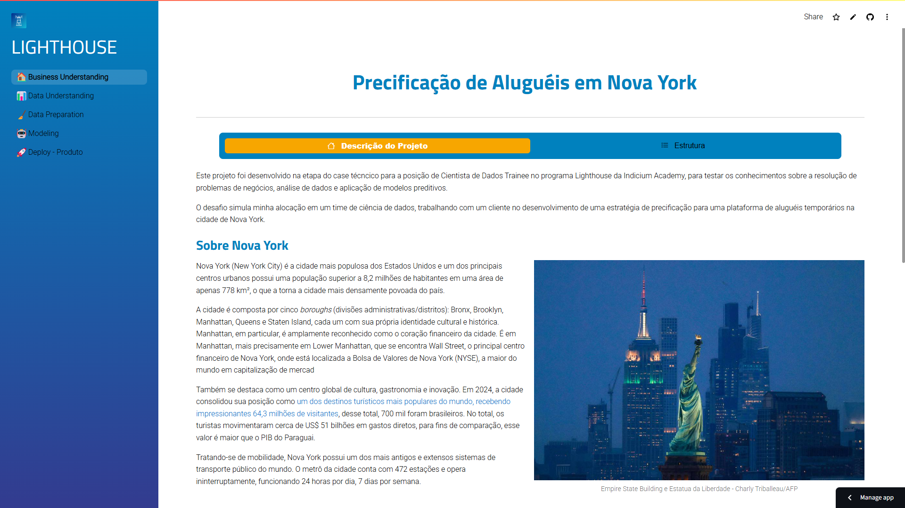

# Case Técnico Programa Lighthouse - Ciência de Dados


## Descrição do Projeto
Este projeto foi desenvolvido na etapa do case técncico para a posição de Cientista de Dados Trainee no programa Lighthouse da Indicium Academy, para testar os conhecimentos sobre a resolução de problemas de negócios, análise de dados e aplicação de modelos preditivos.

O desafio simula minha alocação em um time de ciência de dados, trabalhando com um cliente no desenvolvimento de uma estratégia de precificação para uma plataforma de aluguéis temporários na cidade de Nova York.


## Como Reproduzir
 Acesse a aplicação diretamente através do link de deploy no Streamlit Cloud: [Precificação de Aluguéis em Nova York](https://lh-cd-aurelioguilherme.streamlit.app/).

 Caso a aplicação estiver offline, basta clicar no botão azul escrito: "Yes, get this app back up!" e aguardar o carregamento da aplicação.

 Para reproduzir localmente, siga as seguintes etapas:

1. Clone este repositório:
   ```bash
   https://github.com/AurelioGuilherme/AmbienteDeDesenvolvimento.git
   ```

2. Crie um Ambiente Virtual

   ```bash
    python -m venv .venv
   ```
3. Ative o Ambiênte Vitural
  ```bash
  .venv\Scripts\activate
  ```

4. Instale as dependências listadas no arquivo `requirements.txt`:
   ```bash
   pip install -r requirements.txt
   ```
5. Execute o aplicativo Streamlit:
   ```bash
   streamlit run main.py
   ```
 

## Objetivos

**Defini os seguintes objetivos:**

- Experiênciação de ferramentas usadas para desenvolver um modelo de previsão de preços a partir do dataset oferecido contendo a ducumentação, histórico de desevolvimento e avaliação dos modelos testados utilizando frameworks de MLOps para garantir a eficiência, reprodutibilidade e escalabilidade.

- Uso do framework Streamlit para criar a aplicação Web garantindo uma visualização interativa, diferente de um Jupyter Notebook, contendo todas as etapas do desenvolvimento seguindo o framework CRISP-DM como metodologia.

- Desenvolver um processo de preparação de dados que permita a experimentação de diferentes features, possibilitando defini-las de maneira simples e intuitiva, além de facilitar sua utilização na etapa de modelagem.

- Desenvolver uma aplicação interativa que funcione como um "produto", onde o usuário preenche um formulário com as características desejadas e, com base nos dados fornecidos, o sistema retorna a previsão do preço de forma rápida.

## Sobre os dados
| **Variável**            | **Descrição**                                                                               |
|-------------------------|---------------------------------------------------------------------------------------------|
| `id`                    | Atua como uma chave exclusiva para cada anúncio nos dados do aplicativo                     |
| `nome`                  | Representa o nome do anúncio                                                                |
| `host_id`               | Representa o id do usuário que hospedou o anúncio                                           |
| `host_name`             | Contém o nome do usuário que hospedou o anúncio                                             |
| `bairro_group `         | Contém o nome do bairro onde o anúncio está localizado                                      |
| `bairro `               |  Contém o nome da área onde o anúncio está localizado                                       |
| `latitude`              | Contém a latitude do local.                                                                 |
| `longitude`             | Contém a longitude do local                                                                 |
| `room_type`             | Contém o tipo de espaço de cada anúncio                                                     |
| `price`                 | Contém o preço por noite em dólares listado pelo anfitrião                                  |
| `minimo_noites `        | Contém o número mínimo de noites que o usuário deve reservar                                |
| `numero_de_reviews `    | Contém o número de comentários dados a cada listagem                                        |
| `ultima_review `        | Contém a data da última revisão dada à listagem                                             |
| `reviews_por_mes`       | Contém o número de avaliações fornecidas por mês                                            |
| `calculado_host_listings_count ` | Contém a quantidade de listagem por host                                           |
| `disponibilidade_365 `  | Contém o número de dias em que o anúncio está disponível para reserva                       |


## Metodologia CRISP-DM
Foi utilizada como base para o processo de criação a metodologia de desenvolvimento de projetos de ciência de dados CRISP-DM, com as seguintes etapas

**Business Understanding:**
Trata-se da descrição geral do projeto, contextualização sobre o problema proposto e pesquisa sobre o tema

**Data Understanding:**
Análise dos dados fornecidos, identificando os problemas, testando e hipóteses.
- Descrição dos Dados
- Análise Descritiva
- Análise Inferencial

**Data Preparation:**
Estratégia de tratamento de dados para limpar, transformar e organizar os dados brutos para torná-los adequados para análise e modelagem.
- Abordagem de Experimentação
  - 1ª experimentação - Abordagem com Features Continuas Transformadas em Categóricas
  - 2ª experimentação - Abordagem com Features Continuas Padronizadas.

**Modeling / Evaluation:** 
Etapa de criação e avaliação do Modelo.
- Modelos testados.
  - Modelo Regressão Linear
  - Modelo SVR
  - Modelo XGBoost
- Avaliação
  - MLFlow

**Deploy - Produto:**
Aplicação do modelo treinado para a predição do preço de locação do imóvel em dolares por noite.
A predição é feita usando um forms no Streamlit, retornando o valor previsto e a localização do imóvel.


- **Linguagem**: Python
- **Bibliotecas Principais**:
  - `pandas`, `numpy`,`statsmodels`: Manipulação e análise de dados.
  - `matplotlib`, `seaborn`, `plotly`: Visualizações.
  - `scikit-learn`, `mlflow`, `dagshub`, `xgboost` : Modelagem e métricas de avaliação.
  - `streamlit`: Criação da interface interativa.

## Resultados
- Criação em uma aplicação usando o Streamlit contendo o detalhamento de forma interativa de todas as etapas do projeto.

abaixo está a visualização da aplicação Streamlit:
''''''


  
